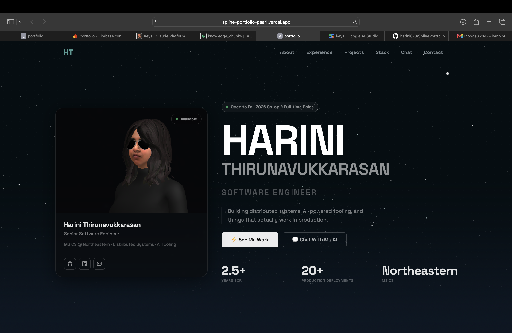

# Harini Thirunavukkarasan — Portfolio

Live: **[spline-portfolio-pearl.vercel.app](https://spline-portfolio-pearl.vercel.app)**



A personal developer portfolio built with React, Vite, and Tailwind CSS, featuring a 3D hero scene, a custom ambient particle system, and an AI chatbot grounded in real RAG (Retrieval-Augmented Generation) over my resume, GitHub activity, and LinkedIn profile.

## Features

- **3D interactive hero** — built with Spline, embedded via `@splinetool/react-spline`
- **Custom ambient particle system** — Canvas 2D animation (no library), drifting teal particles for atmospheric depth across sections
- **Dark glassmorphism UI** — translucent cards, soft depth shadows, single unified font (Space Grotesk)
- **Project detail pages** — each project routes to its own page via React Router instead of expand/collapse
- **RAG-powered AI chatbot** — ask it about my background, projects, or experience; it retrieves grounded context before answering, so it doesn't hallucinate

## RAG Architecture

The chatbot isn't a plain LLM wrapper — it's a real retrieval pipeline:

```
Question
  → embed via Gemini (gemini-embedding-001)
  → vector similarity search in Supabase (pgvector)
  → top matching chunks from resume / GitHub / LinkedIn knowledge base
  → Gemini (gemini-flash-latest) generates the answer using only that retrieved context
```

- **Storage & retrieval**: [Supabase](https://supabase.com) with the `pgvector` extension — a Postgres function (`match_knowledge_chunks`) does cosine similarity search over embedded knowledge chunks
- **Embeddings**: Google Gemini (`gemini-embedding-001`, 768-dim vectors)
- **Generation**: Google Gemini (`gemini-flash-latest`), grounded strictly in retrieved context
- **Backend**: a Vercel serverless function (`api/chat.js`) ties retrieval and generation together
- **Knowledge base**: `rag/knowledge-base.json` — hand-curated chunks from my resume, GitHub public repos, and LinkedIn data export

To re-embed the knowledge base after an update:

```bash
cd rag
npm install
node ingest.mjs
```

## Tech Stack

**Frontend:** React 19, Vite, Tailwind CSS, Framer Motion, React Router, Three.js / Spline
**Backend:** Vercel Serverless Functions, Supabase (Postgres + pgvector), Google Gemini API

## Local Development

```bash
npm install
npm run dev
```

Copy `.env.local.example` to `.env.local` and fill in the required keys (see the file for which ones are frontend-safe vs. backend-only).

## Deployment

Deployed on [Vercel](https://vercel.com) — the `/api` folder ships automatically as serverless functions alongside the static frontend build.
